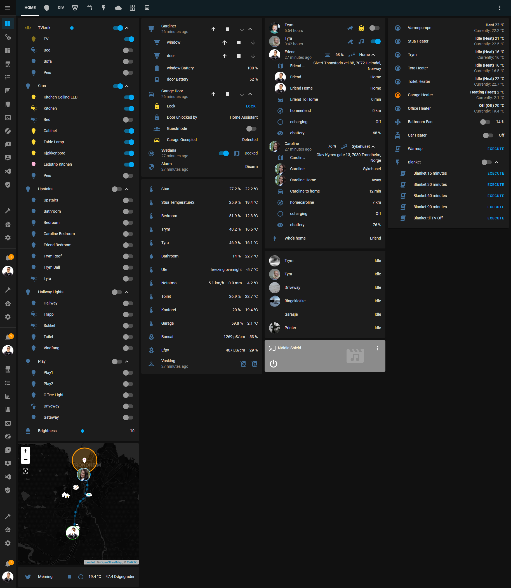
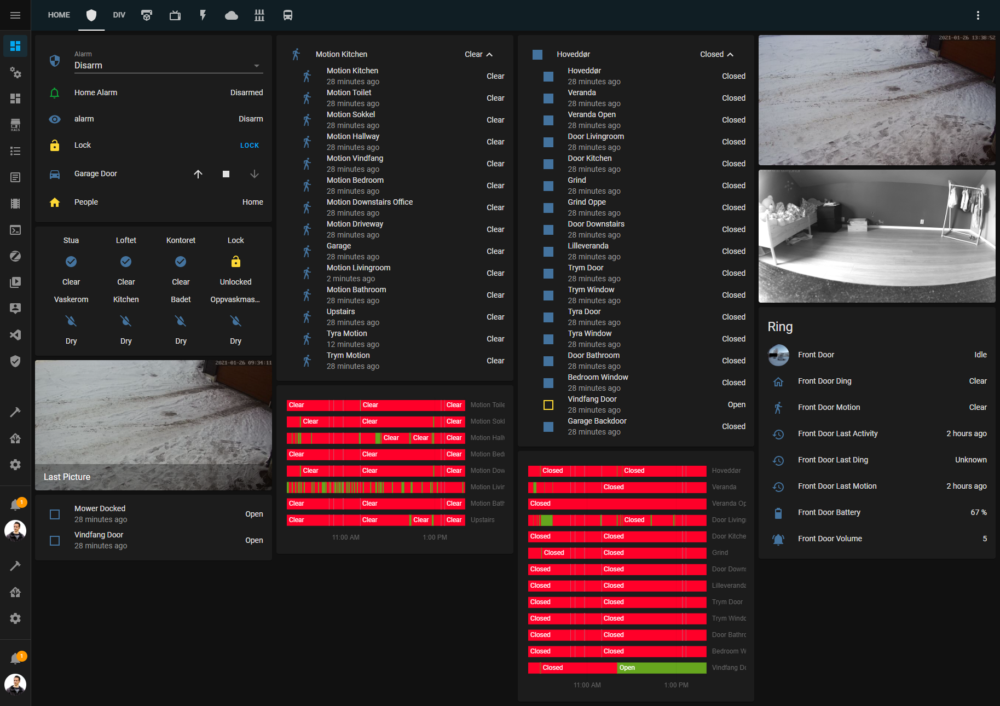
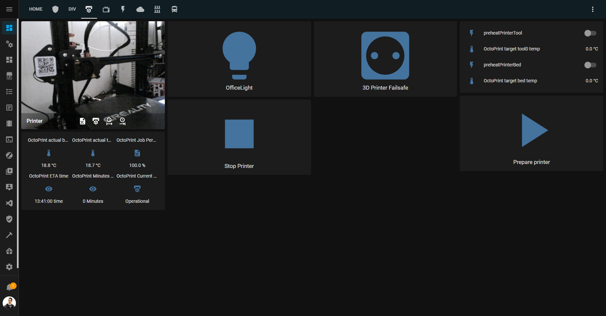
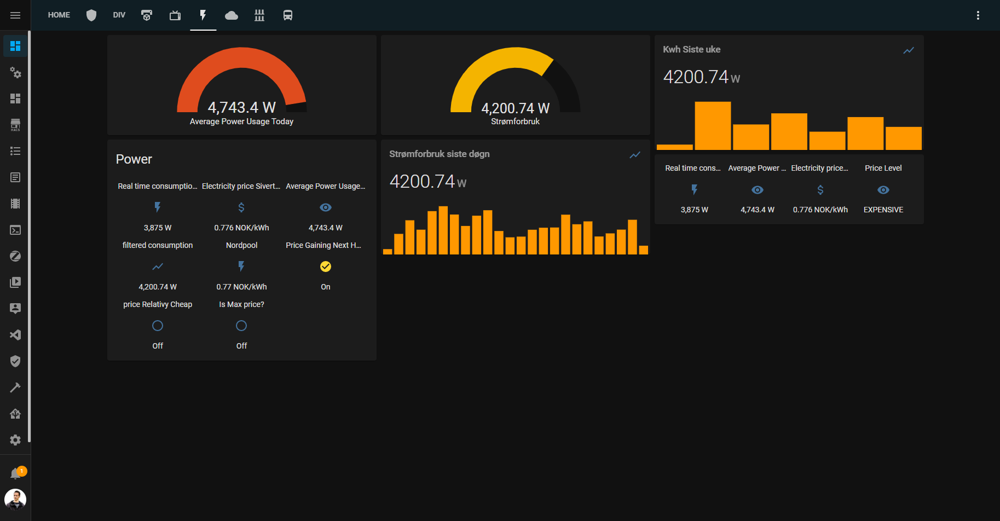
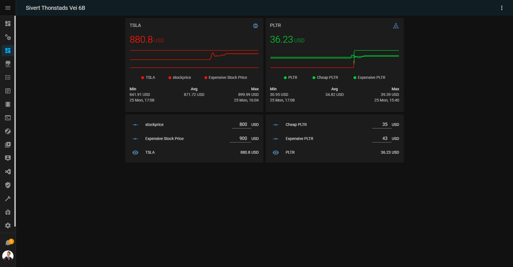

# Erlends Home Assistant Configuration

### The config is due for a cleanup, with lots off commented out code.
### Some files are pretty old and could be organized a lot better with packages.

### Some files are not on github due to security reasons.
#### Also, the code is in a good mix of norwegian and english, but should be readable. 

## Some features:

##### Climate controlled by hourly price, from Nordpool and Tibber integration
If price is peaking, the temperature around the house is decreased by one degree celcius. If the price is gaining the next hour, increase the temperature by one degree.
This helps with lowering the power consumption in the most expensive hours.

##### Automatic alarm
The alarm is armed whenever we leave the house or go to sleep, based on device trackers and sleeping sensors, boiled down to a template alarm sensor.

##### Presence based lights
(Almost) all lights are based on motion sensors and magnet sensors, and will turn on and dim to a specific level, depending on different states.

##### Basic Children tracking
This sound kinda sketchy.
Track if the toddlers are asleep based on when we enter their rooms, or if they are in kindergarden, based on if the device trackers enter the kindergarden zone.
This is used for:
- Quiet time. Turn down the speakers for TTS announcements when the kids are asleep 
- Turn on the light in our bedroom if the kids leave their rooms at night.  
- Notify us if we forgot to lock the stair gates so they can't fall down the stairs
- Notify us if no one has picked them up from kindergarden before it closes.
 

## Screenshots: 

