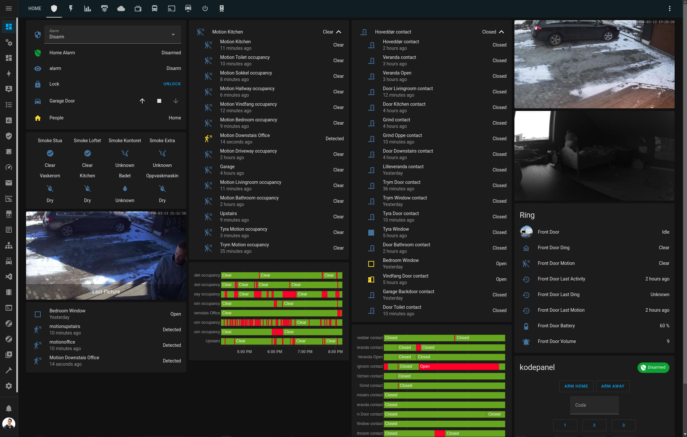

# Erlends Home Assistant Configuration V2

### The config is due for a cleanup, with lots off commented out code.
### Some files are pretty old and could be organized a lot better with packages.

### Some files are not on github due to security reasons.
#### Also, the code is in a good mix of norwegian and english, but should be readable. 

## Some features:

#### Climate controlled by hourly price, from Nordpool and Tibber integration
If price is peaking, the temperature around the house is decreased by one degree celcius. If the price is gaining the next hour, increase the temperature by one degree.
This helps with lowering the power consumption in the most expensive hours.

Water boiler is controlled by Aotec Heavy Duty, and two temperature sensors with ESPHome to create a climate entity. If the power is cheap, set it to 40 degrees, else, set it to 80.

#### Car Control
Control the car like preheating, trunk, frunk, location, battery and such with nofifications, watch(webhooks from tasker) and HA UI without having to fish the phone out from the pocket.

#### Automatic alarm
The alarm is armed whenever we leave the house or go to sleep, based on device trackers and sleeping sensors, boiled down to a template alarm sensor.

#### Presence based lights
(Almost) all lights are based on motion sensors and magnet sensors, and will turn on and dim to a specific level, depending on different states.

#### Basic Children tracking
This sound kinda sketchy.
Track if the toddlers are asleep based on when we enter their rooms, or if they are in kindergarden, based on if the device trackers enter the kindergarden zone.
This is used for:
- Quiet time. Turn down the speakers for TTS announcements when the kids are asleep 
- Turn on the light in our bedroom if the kids leave their rooms at night.  
- Notify us if we forgot to lock the stair gates so they can't fall down the stairs
- Notify us if no one has picked them up from kindergarden before it closes.

#### Smart watch control with Garmin Tasker
With help from the Garmin Tasker app on the Garmin Connect IQ Store, i can with a press or two (or three or four):
- Adjust the brigthness on different light groups in different rooms to my liking
- Toggle TV Power,  either the Bedroom TV or the Living Room TV, based on my 'state'
- Pause the same TV, or skip ads on YouTube
- Control the Volume on the same TV
- Toggle covers like the garage door or blinds
- Turn on the heated blanket in the bed, either for 30 minutes, or turn it on, and leave it on until the TV in the bedroom turns off.
- Control the climate in the car, open the frunk, trunk and charge port.

#### Other:
- Mail delivery days notifications.
- Waste collection notifications
- Game timer. After hunting, game birds are supposed to hang for 40 'daydegrees'. This package appendes the temperature for each hour, and notifies me when the bird is ready for the freezer.
- Stock price notifications using FinnHub.io API

## Specs

- Aqara motion sensors and magnet sensors
- IKEA Trådfri / Hue / Namron lights, switches and bulbs
- Mill Panel Heaters
- heatit z-trm3 thermostats
- Aoetec Heavy Duty for Water Boiler
- Sensibo IR-blaster for heat pump
- Easee EV Charger for smart charging and power management
- Tesla Model Y for presence and car climate control
- Garmin Fenix 6 as a remote for the entire home with Garmin Tasker app
- Aqara and 433mhz temperature and humidity sensors
- Xiaomi water leakage sensors and smoke detectors.
- A-OK Curtain controllers from AliExpress, controlled with ESP32.
- ESP32-based light strips
- ESP32-based garage door and garage occupied sensor.
- Yale Doorman smartlock
- Xiaomi Roborock S5 Vacuum cleaner
- Sonoff controlled bathroom fan, turns on when humidity is high.
- Ikea Trådfri switch for bed blanket warmer 
- Ikea Trådfri switches for electric car heater, with notification before we go to bed if it's freezing overnight.
- Ring Doorbell
- Google Nest speakers for announcement and multi room music.
- Ender 3 3D Printer connected with Octoprint.
- Tibber for power management. (Use Referral code https://invite.tibber.com/11541ba9 for 50 EUR bonus for smarthome equipment)
- MiFlora sensors for plants
- Power monitoring of washer and dryer for notifications when the laundry is done.

## Screenshots: 

